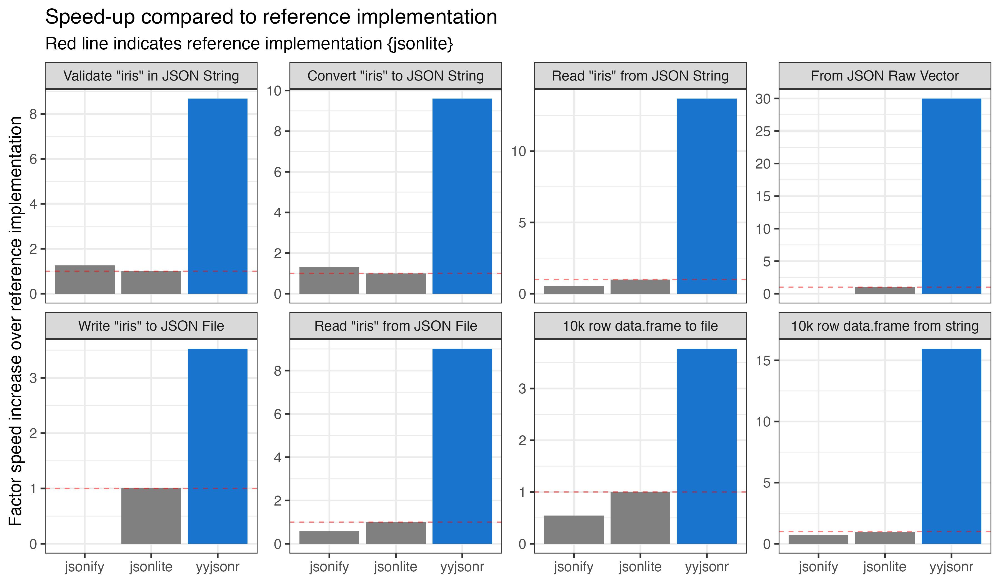
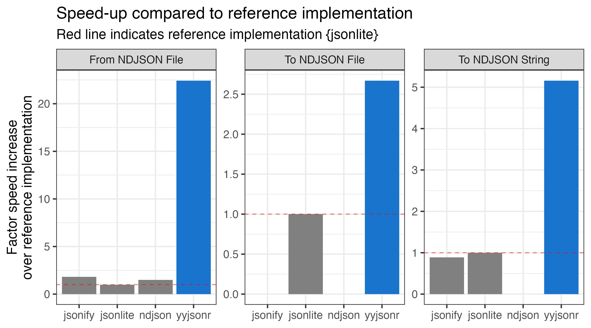
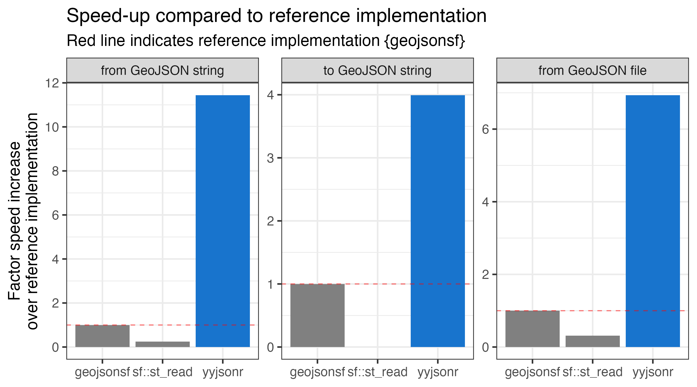

<!-- README.md is generated from README.Rmd. Please edit that file -->

```{r, include = FALSE}
knitr::opts_chunk$set(
  collapse = TRUE,
  comment = "#>",
  fig.path = "man/figures/README-",
  fig.height = 3,
  out.width = "100%"
)

library(tidyr)
library(yyjsonr)

if (FALSE) {
  covr::report(covr::package_coverage(
    line_exclusions = list('src/yyjson.c', 'src/yyjson.h')
  ))
}

if (FALSE) {
  pkgdown::build_site(override = list(destination = "../coolbutuseless.github.io/package/yyjsonr"))
}

# Makevars options to do some deep testing for CRAN

# Type conversions are sane
# PKG_FLAG=-Wconversion

# Pointer overflow checks i.e. dodgy pointer arithmetic
# PKG_CFLAGS+=-fsanitize=pointer-overflow -fsanitize-trap=pointer-overflow
# Then run in the debugger:
# R -d lldb 
# run
# testthat::test_local()
```


# yyjsonr 

<!-- badges: start -->

[](https://cran.r-project.org/package=yyjsonr)
[](https://github.com/coolbutuseless/yyjsonr/actions/workflows/R-CMD-check.yaml)
<!-- badges: end -->

`{yyjsonr}` is a fast JSON parser/serializer, which converts R data to/from JSON.

In most cases it is around 2x to 10x faster than `{jsonlite}` at both reading and writing JSON.

It is a wrapper for the [`yyjson`](https://github.com/ibireme/yyjson) C library (v0.11.1 May 2025).
`yyjson` is MIT licensed - see `LICENSE-yyjson.txt` in this package for more details - 
`readLines(system.file('LICENSE-yyjson.txt', package = 'yyjsonr', mustWork = TRUE))`

### What's in the box

This package contains specialized functions for each type of operation (read/write/validate) and the 
storage location of the JSON (string/file/raw vector/connection).

#### Vanilla JSON

|          | string              | file                 | raw             | conn             | options              |
|----------|---------------------|----------------------|-----------------|------------------|----------------------|
| read     | read_json_str()     | read_json_file()     | read_json_raw() | read_json_conn() | opts_read_json()     |
| write    | write_json_str()    | write_json_file()    |write_json_raw() |                  | opts_write_json()    |
| validate | validate_json_str() | validate_json_file() |                 |                  |                      |


#### NDJSON

|          | string              | file                 | raw              | conn             | options              |
|----------|---------------------|----------------------|------------------|------------------|----------------------|
| read     | read_ndjson_str()   | read_ndjson_file()   |read_ndjson_raw() |                  | opts_read_json()     |
| write    | write_ndjson_str()  | write_ndjson_file()  |write_ndjson_raw()|                  | opts_write_json()    |


#### GeoJSON

|          | string              | file                 | raw                 | conn             | options              |
|----------|---------------------|----------------------|---------------------|------------------|----------------------|
| read     | read_geojson_str()  | read_geojson_file()  | read_geojson_raw()  |                  | opts_read_geojson()     |
| write    | write_geojson_str() | write_geojson_file() | write_geojson_raw() |                  | opts_write_geojson()    |


### Speed 

In the following plots, bigger is better, with `yyjsonr` results in blue.


#### JSON



#### NDJSON



#### GeoJSON



Note: Benchmarks were run on Apple M2 Mac.  See files `man/benchmark/benchmark*.Rmd` for details.

## Installation

This package can be installed from CRAN

``` r
install.packages('yyjsonr')
```


You can install the latest development version from [GitHub](https://github.com/coolbutuseless/yyjsonr) with:

``` r
# install.package('remotes')
remotes::install_github('coolbutuseless/yyjsonr')
```

Pre-built source/binary versions can also be installed from [R-universe](https://r-universe.dev)

``` r
install.packages('yyjsonr', repos = c('https://coolbutuseless.r-universe.dev', 'https://cloud.r-project.org'))
```


Simple JSON example
==============================================================================

```{r}
library(yyjsonr)

str <- write_json_str(head(iris, 3), pretty = TRUE)
cat(str)

read_json_str(str)
```


Simple GeoJSON example
==============================================================================

When parsing GeoJSON, `{yyjsonr}` returns an `sf` object.

```{r}
read_geojson_str(geojsonsf::geo_melbourne) |> 
  head() |>
  sf:::print.sf()
```
    
    
## Limitations

* Some datatypes are not currently supported. Please file an issue on GitHub if
  these types are critical for you.  Providing test cases also appreciated!:
    * Complex numbers
    * POSIXlt
    * Matrices of POSIXct / Date


