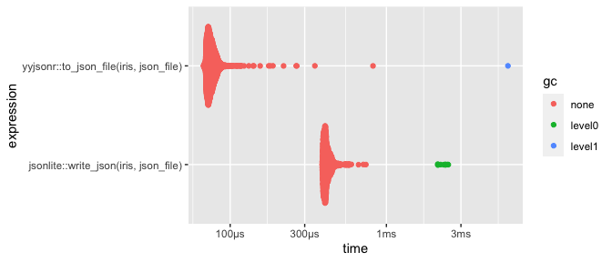
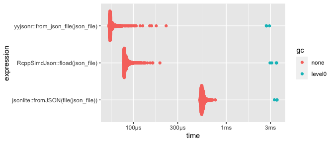
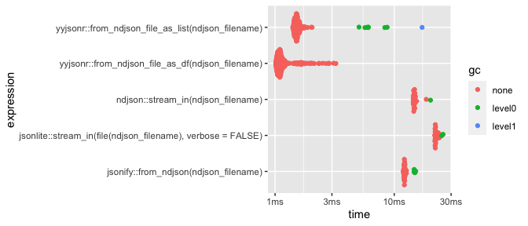
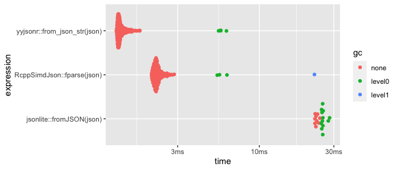
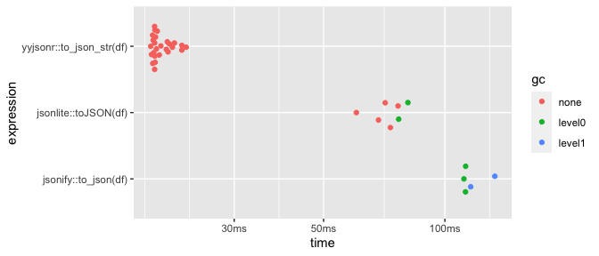
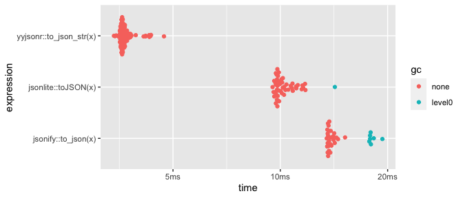
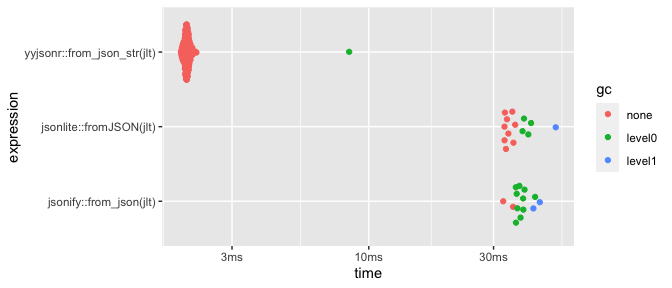

yyjsonr
================

<!-- README.md is generated from README.Rmd. Please edit that file -->

# yyjsonr 

<!-- badges: start -->


[](https://github.com/coolbutuseless/ryyjson-dev/actions/workflows/R-CMD-check.yaml)
<!-- badges: end -->

`{yyjsonr}` is a fast JSON parser/serializer, which converts R data
to/from JSON and NDJSON.

In most cases it is around 2x to 10x faster than `{jsonlite}` at both
reading and writing JSON.

It is based around the [`yyjson`](https://github.com/ibireme/yyjson) C
library.

### Help needed!

If you have an interest in fast JSON reading/writing in R, then **I need
your help**.

The scope of this package and options it supports are still in flux.
What can I add to help your JSON needs? Open an issue on github and let
me know!

You can assist by:

- Finding cases that give unexpected results for your JSON needs
- Suggesting how you want to have a particular JSON object to appear in
  R
- Propose configuration options to control a particular aspect of how
  *you* want JSON to translate to/from R
- Trying it out in your package as an alternative to your current JSON
  package.
  - Is it worth the change?
  - What functionality is lacking?
  - What would you need to make the switch proper?
- Suggesting additional interesting benchmarks/tests.
- Creating/Donating a nice hex logo!

### The `yyjson` C library

This package includes the [`yyjson`](https://github.com/ibireme/yyjson)
C library (version `YYJSON_VERSION_HEX = 0x000700`).

`yysjon` is MIT licensed - see `LICENSE-yyjson.txt` in this package for
more details.

### What’s in the box

- Write R objects to JSON
  - `to_json_str()`, `to_json_file()`
- Read in JSON as R objects
  - `from_json_str()`, `from_json_file()`, `from_json_conn()`
- Read in NDJSON
  - `from_ndjson_file_as_list()`, `from_ndjson_file_as_df()`
- `to_opts()`, `from_opts()` construct configuration options for
  reading/writing JSON

### Comparison to other JSON packages

|              | R to JSON | JSON to R | ndjson read | ndjson write |
|--------------|-----------|-----------|-------------|--------------|
| yyjsonr      | Fast!     | Fast!     | Fast!       | Not yet      |
| jsonlite     | Yes       | Yes       | Yes         | Yes          |
| RcppSimdJson | No        | Fast!     | No          | No           |
| jsonify      | Yes       | Yes       | Yes         | Yes          |

## Installation

You can install from [GitHub](https://github.com/coolbutuseless/yyjsonr)
with:

``` r
# install.package('remotes')
remotes::install_github('coolbutuseless/yyjsonr')
```

# R to JSON string

``` r
str <- to_json_str(head(iris, 3), pretty = TRUE)
cat(str)
#> [
#>   {
#>     "Sepal.Length": 5.1,
#>     "Sepal.Width": 3.5,
#>     "Petal.Length": 1.4,
#>     "Petal.Width": 0.2,
#>     "Species": "setosa"
#>   },
#>   {
#>     "Sepal.Length": 4.9,
#>     "Sepal.Width": 3.0,
#>     "Petal.Length": 1.4,
#>     "Petal.Width": 0.2,
#>     "Species": "setosa"
#>   },
#>   {
#>     "Sepal.Length": 4.7,
#>     "Sepal.Width": 3.2,
#>     "Petal.Length": 1.3,
#>     "Petal.Width": 0.2,
#>     "Species": "setosa"
#>   }
#> ]

from_json_str(str)
#>   Sepal.Length Sepal.Width Petal.Length Petal.Width Species
#> 1          5.1         3.5          1.4         0.2  setosa
#> 2          4.9         3.0          1.4         0.2  setosa
#> 3          4.7         3.2          1.3         0.2  setosa
```

## Benchmark: R to JSON string

<details>
<summary>
Show/Hide benchmark code
</summary>

``` r
res <- bench::mark(
  jsonlite::toJSON(iris),
  jsonify::to_json(iris),
  yyjsonr::to_json_str(iris),
  check = FALSE
)
#> Registered S3 method overwritten by 'jsonify':
#>   method     from    
#>   print.json jsonlite

knitr::kable(res[,1:5])
```

| expression                 |     min |  median |   itr/sec | mem_alloc |
|:---------------------------|--------:|--------:|----------:|----------:|
| jsonlite::toJSON(iris)     | 326.6µs | 361.4µs |  2725.886 |    2.17MB |
| jsonify::to_json(iris)     | 236.4µs | 254.3µs |  3873.617 |    4.91MB |
| yyjsonr::to_json_str(iris) |  60.4µs |  67.4µs | 14524.304 |        0B |

</details>


## Benchmark: JSON string to R

<details>
<summary>
Show/Hide benchmark code
</summary>

``` r
json_str <- to_json_str(iris)
res <- bench::mark(
  jsonlite::fromJSON(json_str),
  jsonify::from_json(json_str),
  RcppSimdJson::fparse(json_str),
  yyjsonr::from_json_str(json_str),
  check = FALSE
)
knitr::kable(res[,1:5])
```

| expression                       |     min |  median |   itr/sec | mem_alloc |
|:---------------------------------|--------:|--------:|----------:|----------:|
| jsonlite::fromJSON(json_str)     | 457.4µs | 532.8µs |  1876.522 |  427.19KB |
| jsonify::from_json(json_str)     | 718.3µs | 772.8µs |  1292.290 |    36.2KB |
| RcppSimdJson::fparse(json_str)   |  48.1µs |    52µs | 18955.674 |  107.09KB |
| yyjsonr::from_json_str(json_str) |    44µs |  47.1µs | 20995.343 |    6.09KB |

</details>


# R to JSON file

``` r
to_json_file(iris, tempfile())
```

## Benchmark: R to JSON file

<details>
<summary>
Show/Hide benchmark code
</summary>

``` r
json_file <- tempfile()
res <- bench::mark(
  jsonlite::write_json(iris, json_file),
  yyjsonr::to_json_file(iris, json_file),
  check = FALSE
)

knitr::kable(res[, 1:5])
```

| expression                             |     min |  median |   itr/sec | mem_alloc |
|:---------------------------------------|--------:|--------:|----------:|----------:|
| jsonlite::write_json(iris, json_file)  | 389.5µs | 414.2µs |  2373.233 |    48.8KB |
| yyjsonr::to_json_file(iris, json_file) |  86.6µs |  93.5µs | 10519.602 |    5.18KB |

</details>



## Benchmark: JSON file to R

<details>
<summary>
Show/Hide benchmark code
</summary>

``` r
json_file <- tempfile()
jsonlite::write_json(iris, json_file)
res <- bench::mark(
  jsonlite::fromJSON(file(json_file)), 
  RcppSimdJson::fload(json_file), 
  yyjsonr::from_json_file(json_file),
  check = TRUE
)

knitr::kable(res[, 1:5])
```

| expression                          |     min |  median |   itr/sec | mem_alloc |
|:------------------------------------|--------:|--------:|----------:|----------:|
| jsonlite::fromJSON(file(json_file)) | 520.9µs | 550.4µs |  1792.103 |   145.9KB |
| RcppSimdJson::fload(json_file)      |  78.1µs |    82µs | 11946.916 |   136.4KB |
| yyjsonr::from_json_file(json_file)  |  54.7µs |  56.5µs | 17170.412 |    10.2KB |

</details>



# Parsing ndjson

`ndjson` is “newline delimited json” which is multiple json strings in a
file, with each string separated by a newline. This is a convenient
storage method for lots of similarly structured objects e.g. log output.

There are options to read only a subset of lines from the ndjson file
(`nskip` and `nread`) - which can lead to time savings if only a subset
of lines are needed.

``` r
ndjson_file <- tempfile()

{
  # Setup an 'ndjson' file to read back in
  df <- head( nycflights13::flights[, 1:5], 2)
  jsonlite::stream_out(df, file(ndjson_file), verbose = FALSE)
}

from_ndjson_file_as_df(ndjson_file)
#>   year month day dep_time sched_dep_time
#> 1 2013     1   1      517            515
#> 2 2013     1   1      533            529
from_ndjson_file_as_list(ndjson_file)
#> [[1]]
#> [[1]]$year
#> [1] 2013
#> 
#> [[1]]$month
#> [1] 1
#> 
#> [[1]]$day
#> [1] 1
#> 
#> [[1]]$dep_time
#> [1] 517
#> 
#> [[1]]$sched_dep_time
#> [1] 515
#> 
#> 
#> [[2]]
#> [[2]]$year
#> [1] 2013
#> 
#> [[2]]$month
#> [1] 1
#> 
#> [[2]]$day
#> [1] 1
#> 
#> [[2]]$dep_time
#> [1] 533
#> 
#> [[2]]$sched_dep_time
#> [1] 529
```

## Benchmark: Parsing ndjson

<details>
<summary>
Show/Hide benchmark code
</summary>

``` r
#~~~~~~~~~~~~~~~~~~~~~~~~~~~~~~~~~~~~~~~~~~~~~~~~~~~~~~~~~~~~~~~~~~~~~~~~~~~~
#' Set-up benchmark data
#~~~~~~~~~~~~~~~~~~~~~~~~~~~~~~~~~~~~~~~~~~~~~~~~~~~~~~~~~~~~~~~~~~~~~~~~~~~~
ndjson_filename <- tempfile()
df <- head( nycflights13::flights, 1000)
jsonlite::stream_out(df, file(ndjson_filename), verbose = FALSE)

#~~~~~~~~~~~~~~~~~~~~~~~~~~~~~~~~~~~~~~~~~~~~~~~~~~~~~~~~~~~~~~~~~~~~~~~~~~~~
#' benchmark
#~~~~~~~~~~~~~~~~~~~~~~~~~~~~~~~~~~~~~~~~~~~~~~~~~~~~~~~~~~~~~~~~~~~~~~~~~~~~
res <- bench::mark(
  ndjson::stream_in(ndjson_filename),
  jsonlite::stream_in(file(ndjson_filename), verbose = FALSE),
  jsonify::from_ndjson(ndjson_filename),
  yyjsonr::from_ndjson_file_as_list(ndjson_filename),
  yyjsonr::from_ndjson_file_as_df  (ndjson_filename),
  check = FALSE
)

knitr::kable(res[, 1:5])
```

| expression                                                  |     min |  median |   itr/sec | mem_alloc |
|:------------------------------------------------------------|--------:|--------:|----------:|----------:|
| ndjson::stream_in(ndjson_filename)                          | 14.43ms | 14.73ms |  67.34481 |    3.62MB |
| jsonlite::stream_in(file(ndjson_filename), verbose = FALSE) | 21.84ms | 22.24ms |  44.31303 |    1.26MB |
| jsonify::from_ndjson(ndjson_filename)                       | 11.88ms | 12.18ms |  81.96709 |  568.56KB |
| yyjsonr::from_ndjson_file_as_list(ndjson_filename)          |  1.41ms |  1.52ms | 653.19715 |  404.22KB |
| yyjsonr::from_ndjson_file_as_df(ndjson_filename)            |  1.02ms |   1.1ms | 846.07737 |   95.03KB |

</details>



# More Benchmarks

## Benchmark from `{RcppSimdJson}`

<details>
<summary>
Show/Hide benchmark code
</summary>

``` r
jsonfile <- system.file("jsonexamples", "twitter.json", package="RcppSimdJson")
json <- paste(readLines(jsonfile), collapse = "\n")

res <- bench::mark(
  jsonlite::fromJSON(json),
  RcppSimdJson::fparse(json),
  yyjsonr::from_json_str(json),
  check = FALSE
)

knitr::kable(res[, 1:5])
```

| expression                   |    min |  median |   itr/sec | mem_alloc |
|:-----------------------------|-------:|--------:|----------:|----------:|
| jsonlite::fromJSON(json)     | 22.7ms | 23.06ms |  42.93444 |     832KB |
| RcppSimdJson::fparse(json)   | 2.04ms |  2.19ms | 449.47419 |     182KB |
| yyjsonr::from_json_str(json) | 1.22ms |  1.27ms | 767.22580 |     214KB |

</details>



## Benchmark from `{jsonify}`

<details>
<summary>
Show/Hide benchmark code
</summary>

``` r
n <- 1e5
df <- data.frame(
  id = 1:n
  , value = sample(letters, size = n, replace = T)
  , val2 = rnorm(n = n)
  , log = sample(c(T,F), size = n, replace = T)
  , stringsAsFactors = FALSE
)

res <- bench::mark(
  jsonlite::toJSON( df ),
  jsonify::to_json( df ),
  yyjsonr::to_json_str( df ),
  check = FALSE
)
#> Warning: Some expressions had a GC in every iteration; so filtering is
#> disabled.

knitr::kable(res[,1:5])
```

| expression               |     min |  median |  itr/sec | mem_alloc |
|:-------------------------|--------:|--------:|---------:|----------:|
| jsonlite::toJSON(df)     |  60.3ms |  73.2ms | 13.79801 |   20.81MB |
| jsonify::to_json(df)     | 111.5ms | 112.6ms |  8.53920 |     8.3MB |
| yyjsonr::to_json_str(df) |  18.6ms |  19.2ms | 50.40402 |    6.01MB |

</details>



<details>
<summary>
Show/Hide benchmark code
</summary>

``` r
n <- 1e4
x <- list(
  x = rnorm(n = n)
  , y = list(x = rnorm(n = n))
  , z = list( list( x = rnorm(n = n)))
  , xx = rnorm(n = n)
  , yy = data.frame(
      id = 1:n
      , value = sample(letters, size = n, replace = T)
      , val2 = rnorm(n = n)
      , log = sample(c(T,F), size = n, replace = T)
    )
)

res <- bench::mark(
 jsonlite::toJSON( x ),
 jsonify::to_json( x ),
 yyjsonr::to_json_str(x),
 check = FALSE
)


knitr::kable(res[,1:5])
```

| expression              |    min | median |   itr/sec | mem_alloc |
|:------------------------|-------:|-------:|----------:|----------:|
| jsonlite::toJSON(x)     | 9.51ms | 9.94ms |  97.69311 |    3.34MB |
| jsonify::to_json(x)     | 13.5ms | 13.7ms |  72.16428 |    1.88MB |
| yyjsonr::to_json_str(x) | 3.41ms | 3.62ms | 271.92525 |    1.34MB |

</details>



<details>
<summary>
Show/Hide benchmark code
</summary>

``` r
jlt <- jsonlite::toJSON( x )

res <- bench::mark(
  jsonlite::fromJSON( jlt ),
  jsonify::from_json( jlt ),
  yyjsonr::from_json_str(jlt),
  check = FALSE
)

knitr::kable(res[,1:5])
```

| expression                  |     min |  median |   itr/sec | mem_alloc |
|:----------------------------|--------:|--------:|----------:|----------:|
| jsonlite::fromJSON(jlt)     | 32.65ms | 33.78ms |  29.59399 |    2.37MB |
| jsonify::from_json(jlt)     | 32.31ms | 32.64ms |  30.55011 |    1.34MB |
| yyjsonr::from_json_str(jlt) |  1.86ms |  1.97ms | 506.21367 |  547.25KB |

</details>



# Parsing differences compared to `{jsonlite}`

## Numeric types retained in presence of other strings

`{yyjsonr}` does not promote numeric values in arrays to strings if the
array contains a string. Instead the R container is promoted to a
`list()` in order to retain original types.

Note: this could be controlled by a flag if desired. Open an issue and
let me know what you need!

``` r
json <- '[1,2,3,"apple"]'
jsonlite::fromJSON(json)
#> [1] "1"     "2"     "3"     "apple"
yyjsonr::from_json_str(json)
#> [[1]]
#> [1] 1
#> 
#> [[2]]
#> [1] 2
#> 
#> [[3]]
#> [1] 3
#> 
#> [[4]]
#> [1] "apple"
```

## 3-d arrays are parsed as multiple 2-d matrices and combined

In `{yyjsonr}` the order in which elements in an array are serialized to
JSON correspond to an array of row-major matrices in human-readable
order.

`{jsonlite}` does things differently. The array formats are internally
consistent within each package, but not cross-compatible between them
i.e. you cannot serialize an array in `{yyjsonr}` and re-create it
exactly using `{jsonlite}`.

``` r
mat <- array(1:12, dim = c(2,3,2))
mat
#> , , 1
#> 
#>      [,1] [,2] [,3]
#> [1,]    1    3    5
#> [2,]    2    4    6
#> 
#> , , 2
#> 
#>      [,1] [,2] [,3]
#> [1,]    7    9   11
#> [2,]    8   10   12

str <- jsonlite::toJSON(mat)
str
#> [[[1,7],[3,9],[5,11]],[[2,8],[4,10],[6,12]]]
jsonlite::fromJSON(str)
#> , , 1
#> 
#>      [,1] [,2] [,3]
#> [1,]    1    3    5
#> [2,]    2    4    6
#> 
#> , , 2
#> 
#>      [,1] [,2] [,3]
#> [1,]    7    9   11
#> [2,]    8   10   12


str <- yyjsonr::to_json_str(mat)
str
#> [1] "[[[1,3,5],[2,4,6]],[[7,9,11],[8,10,12]]]"
yyjsonr::from_json_str(str)
#> , , 1
#> 
#>      [,1] [,2] [,3]
#> [1,]    1    3    5
#> [2,]    2    4    6
#> 
#> , , 2
#> 
#>      [,1] [,2] [,3]
#> [1,]    7    9   11
#> [2,]    8   10   12
```

## Limitiations

- Some datatypes not currently supported:
  - Complex numbers
  - POSIXlt
  - Matrices of POSIXct / Date

## Acknowledgements

- R Core for developing and maintaining the language.
- CRAN maintainers, for patiently shepherding packages onto CRAN and
  maintaining the repository
